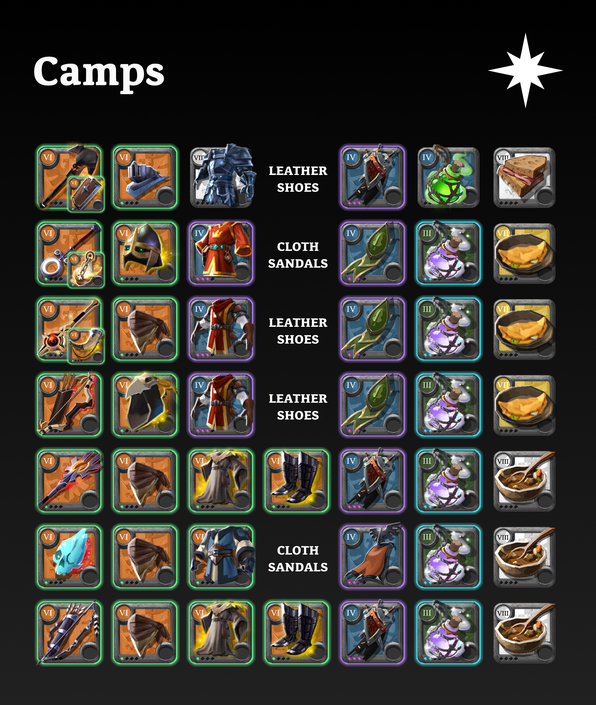



# Camps

## Roles

1. **Tank** [Incubus Mace](#incubus-mace)
2. **Healer** [Holy Staff](#holy-staff)
3. **Support** [Shadowcaller](#shadowcaller)
4. **DPS** [Bow of Badon](#bow-of-badon)
5. **DPS** [Blazing Staff](#blazing-staff)
6. **DPS** [Permafrost Prism](#permafrost-prism)
7. **DPS** [Longbow](#longbow)

## Everyone

- Weapon, off-hand, armour T7 (or equivalent)
- Cape T4.3
- Riding/Armored Horse, Bag T5
- 5 × Calming Potion T3.2 (Tank 20 × Poison Potion T4)
- 3 × *food*
- 10 × Siphoned Energy

## Incubus Mace

- Incubus Mace (2 4 1 2)
- Sarcophagus
- Soldier Helmet (3 1)
- Guardian Armor (3 1 2)
- *leather shoes* (2 4)
- Caerleon Cape
- 20 × Poison Potion T4
- 3 × Beef Sandwich T8

## Holy Staff

- Holy Staff (3 2 1 1) / *any holy staff* (3 2 1 1)
- Celestial Censer
- Graveguard Helmet (3 1)
- Royal Robe (3 1)
- *cloth sandals* (2 2)
- Lymhurst Cape
- 5 × Calming Potion T3.2
- 3 × Pork Omelette T7

## Shadowcaller

- Shadowcaller (3 4 1 1)
- Mistcaller
- Assassin Hood (3 1)
- Royal Jacket (3 1)
- *leather shoes* (2 4)
- Lymhurst Cape
- 5 × Calming Potion T3.2
- 3 × Pork Omelette T7

## Bow of Badon

- Bow of Badon (2 1 1 3)
- Druid Cowl (3 1)
- Royal Jacket (3 3)
- *leather shoes* (3 4)
- Lymhurst Cape
- 5 × Calming Potion T3.2
- 3 × Pork Omelette T7

## Blazing Staff

- Blazing Staff (2 3 1 4)
- Assassin Hood (3 3)
- Druid Robe (3 1)
- Stalker Shoes (3 2)
- Caerleon Cape
- 5 × Calming Potion T3.2
- 3 × Beef Stew T8

## Permafrost Prism

- Permafrost Prism (2 5 1 3)
- Assassin Hood (3 1)
- Scholar Robe (3 1)
- *cloth sandals* (2 2)
- Morgana Cape
- 5 × Calming Potion T3.2
- 3 × Beef Stew T8

## Longbow

- Longbow (2 4 1 3)
- Assassin Hood (3 3)
- Druid Robe (3 1)
- Stalker Shoes (3 2)
- Caerleon Cape
- 5 × Calming Potion T3.2
- 3 × Beef Stew T8
