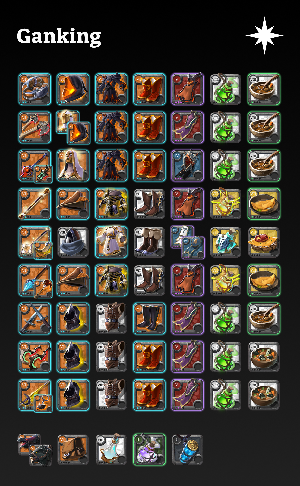



# Ganking

## Roles

- **Dismount** [Claws](#claws)
- **Dismount/DPS** [Bear Paws](#bear-paws)
- **Catch** [Grailseeker](#grailseeker)
- **DPS** [Cursed Staff](#cursed-staff)
- **Healer** [Hallowfall](#hallowfall)
- **Fill Catch/DPS** [Frost Staff](#frost-staff)
- **Fill DPS** [Dagger Pair](#dagger-pair) / [Deathgivers](#deathgivers) / [Bloodletter](#bloodletter)

## Everyone

- Weapon, off-hand, armour T8 (or equivalent)
- T7 allowed for expensive artefact armour
- Demon/Thetford Cape T5.3, other capes T4.3
- Require 100 specialisation on weapon (prefer 800)
- Direwolf/Morgana Raven or any fast mount
- Bag T6
- 5 × *main potion*
- 3 × *food*
- 10 × Poison Potion T8 (if not main potion)
- 2 × Invisibility Potion
- 2 × Calming Potion T3.1
- 10 × Siphoned Energy

## Claws
- Claws (3 2/4 1 1)
- Fiend Cowl (3 1)
- Fiend Robe (3 1)
- Royal Sandals (3 2)
- Demon Cape
- 5 × Poison Potion T8
- 3 × Beef Stew T8.1

## Bear Paws
- Bear Paws (3 2/3 1 1)
- Fiend Cowl (3 1) / Helmet of Valor (3 1)
- Fiend Robe (3 1)
- Royal Sandals (3 2)
- Thetford Cape
- 5 × Poison Potion T8
- 3 × Beef Stew T8.1

## Cursed Staff

- Cursed Staff (1/2 1/2 1 3) / Cryptcandle
- Cowl of Purity (3 1)
- Fiend Robe (3 1)
- Royal Sandals (3 2)
- Caerleon Cape
- 5 × Poison Potion T8
- 3 × Beef Stew T8.1

## Grailseeker

- Grailseeker (1 2 1 1)
- Skinner Cap (4 •)
- Graveguard Armor (3 2 1)
- Hunter Shoes (3 2)
- Demon Cape
- 5 × Sticky Potion T7
- 3 × Pork Omelette T7.1

## Hallowfall

- Hallowfall (1 2 1 1) / Mistcaller
- Mercenary Hood (3/2 1)
- Robe of Purity (3 1)
- Mercenary Shoes (3 2)
- Martlock Cape / Fort Sterling Cape
- 5 × Resistance Potion T7
- 3 × Dusthole Crab Omelette T7

## Frost Staff

- Frost Staff (3 2 1 1) / Leering Cane
- Skinner Cap (4 •)
- Graveguard Armor (3 2 1)
- Hunter Shoes (3 2)
- Demon Cape
- 5 × Sticky Potion T7
- 3 × Pork Omelette T7.1

## Dagger Pair

- Dagger Pair (3 2/4 1 1)
- Stalker Hood (3 1)
- Assassin Jacket (3 1)
- Hellion Shoes (3 2)
- Thetford Cape
- 5 × Poison Potion T8
- 3 × Beef Stew T8.1

## Deathgivers

- Deathgivers (3 2/4 1 1)
- Stalker Hood (3 1)
- Assassin Jacket (3 1)
- Royal Sandals (3 2)
- Thetford Cape
- 5 × Poison Potion T8
- 3 × Deadwater Eel Stew T8

## Bloodletter

- Bloodletter (3 2/4 1 1) / Muisak
- Stalker Hood (3 1)
- Assassin Jacket (3 1)
- Royal Sandals (3 2)
- Thetford Cape
- 5 × Poison Potion T8
- 3 × Deadwater Eel Stew T8
